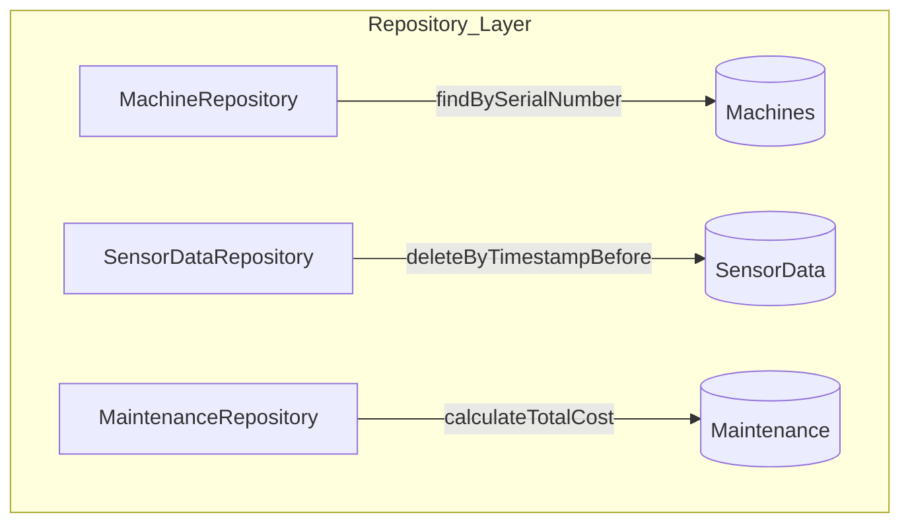

# Maintenance-Platform---Backend
### **1. Domain Layer (Entities)**

```markdown


### **2. Repository Layer**

```markdown


**Key Operations**:
- Standard CRUD (Create, Read, Update, **Delete**)
- Custom queries (time-range filters, aggregates)
- Soft delete option available

